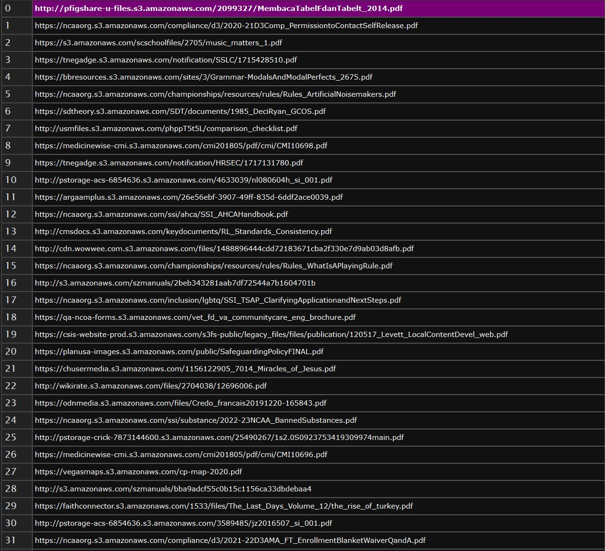

## 📜 Description

GSP Pro was developed for the primary purposes of Lead Generation and Pentesting by utilizing Google Dorks. By downloading, using, and, or any other means of interacting with the code, the end user agrees to voluntarily relinquish their rights to legal action towards the individuals associated with its creation and to follow all laws in their jurisdiction as defined by their country of citizenship and, or residence.

This includes but is not limited to:

- Following email sending guidelines, assuming GSP is used for lead generation.
- Only dorking domains you have permission to scan, assuming GSP is used for pentesting.
- Reporting any personal information found to the company in question as per regulatory guidelines.

## ✨ Features

- Automatic Data Backups
- Memory Load Monitor
- Multithreaded Parsing
- Proxy Rotation
- Proxy Support (HTTP/HTTPS/SOCKS4/SOCKS5)
- Proxy Verification
- RECAPTCHAV2 Solver
- Vulnerability Scanner

## 🛠️ Roadmap

**Bug Fixes:**
- Currently: `None`

**Utility Files:**

- `browserv2.py` - Rewrite `browser.py` to use pyppeteer to utilize an actual headless driver instead of simply placing the window off-screen.
- `crash.py` - Implement crash reporting to `data/crashReports`, logging potential issues during runtime.
- `logger.py` - Implement a runtime logger similar to `crash.py`, except this will run independently of any crash handling.

## 💻 System Requirements

These are the non-package requirements to run this application.

- 4GB DDR3 RAM
- Google Chrome (Latest) - [Download link](https://www.google.com/chrome/dr/download/)
- Python 3.10 (64 bit) - [Download link](https://www.python.org/ftp/python/3.10.0/python-3.10.0-amd64.exe)
- Windows 10

## ⚙️ Installation

- Clone the repository to your local machine.
- Install the required dependencies using `pip install -r requirements.txt`.
- Place your queries in `queries.txt`.
- Place your proxies in `proxies.txt`.

**Note:** To run the application, open Command Prompt and navigate to the directory containing `main.py`, then execute the following command: `<your python path variable> main.py`

- Example 1: `python main.py`
- Example 2: `python3 main.py`

**ADVANCED USER NOTICE:** If you are familiar with configuration files, feel free to modify the included `config.ini` file to fully utilize our application!

## 🎥 Demonstration

### 📊 Results

## 🌟 Credits

**Developed with 💙 by [Callahan Ventures LLC](https://callahanventures.com/)**

### Special Thanks To:

- **[sarperavci](https://github.com/sarperavci/GoogleRecaptchaBypass)** for providing a repository to solve RECAPTCHA V2.
- **[cordlesscoder](https://github.com/cordlesscoder/)** for assisting with code refactoring
